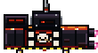

# AERIAL THIEF · HARPOONER (variant 2)

Specialized aerial thief. Instead of dropping a claw on a cable,
this one carries a top-mounted harpoon launcher and fires UPWARD to
snag cargo from below.



## Spec

| Field | Value |
|---|---|
| Canvas size       | **110 × 60 px** (render resolution + 4 px padding) |
| Background        | Transparent (alpha = 0) |
| Pixel scale       | 1× native |
| Facing direction  | LEFT (negative X — chases the rig from behind) |
| Anchor (pivot)    | Body center — slice `center` at **(55, 36)** |
| Active sprite bbox | Roughly **x=4..106, y=4..56** |

## Aseprite tags

The harpooner has more beats than the cable variants — it charges,
fires, then reels back in. A single `idle` covers the basics; the
rest is polish. Listed so you can see the full state cycle.

| Tag | Frames | When game uses it |
|---|---|---|
| `idle`     | 1+ | Cruise. Harpoon loaded, charge LED dim. Flying horizontally toward the rig. |
| `charging` | 1+ | Lock-on hover for ~12 frames before firing. Charge LED ramps up — good fit for a multi-frame loop. |
| `firing`   | 1   | Mid-fire pose. Harpoon tip already extended out of frame (drawn in code). |
| `retract`  | 1   | Harpoon cable reeling back in — with or without snagged cargo. |
| `retreat`  | 1   | Climbs / flees after the attempt. Slight nose-up tilt works well. |
| `damaged`  | 1   | Optional. Sparking launcher, scorched hull, flickering LED. Right now we just puff-explode on destruction. |

The harpoon tip mid-flight, cable, energy field, and engine flames
all get drawn in code on top of your sprite. You're responsible for
the body, the launcher mast, and the loaded tip sitting in the cradle.

## What to draw

- **Hull** — boxy main body (similar proportions to the alt thief)
- **Harpoon launcher mast** on top of the hull — the tall vertical
  mount is what makes this variant the harpooner
- **Loaded harpoon** sitting in the launcher (bullet-shaped tip)
- **Charge LED indicator** on the launcher base. 4 stages (dim → hot)
- **Skull-and-crossbones decal** on the flank
- **Hot-rod flame strips** along the top edge
- **Battle damage** — scorch spots
- Two thruster nozzles on the underside. Draw the nozzle housing
  only; the white-hot flame is drawn in code.
- Engine intakes / vents at the rear

## What NOT to draw

- The harpoon **tip mid-flight** — animates outward in code when firing
- The **cable** trailing behind the fired harpoon
- The **glowing energy field** around the harpoon when loaded
- Engine flame from the nozzles
- Stun / damage effects on hit

## Charge LED states

The launcher has a 4-stage LED that ramps during charging. Either:
draw it dim in `idle` and let the game brighten it, OR draw
multiple frames (one per stage) tagged `charging` and we'll cycle
through them.

## Palette

Stay inside `art/palette/dlx-master-palette.gpl`. Use **AERIAL THIEF**
for the body, **OUTLINE / DARKS** for shadows, plus the warm flame
tones and a couple of cyan / red highlights for the LED states.

## Variants in code

| Folder | Variant | Distinguishing feature |
|---|---|---|
| `../gunship/`       | 0 | Swept nose, classic silhouette |
| `../gunship_alt/`   | 1 | Blunt front bumper, longer hull |
| `harpooner/` (this) | 2 | Upward harpoon launcher on top |

## Export

```bash
aseprite -b harpooner.aseprite \
  --sheet harpooner.png \
  --data  harpooner.json \
  --sheet-pack --format json-array
```

Or `File → Save As → harpooner.png` for a single frame.

Commit `.aseprite` + `.png` together, or DM the team.
</parameter>
