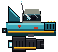
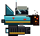

# HERO RIG · ROAD KILL

The current player rig — DLX-branded mid-haul cargo vehicle.




## Spec

| Field | Value |
|---|---|
| Canvas size       | **58 × 52 px** |
| Background        | Transparent (alpha = 0) |
| Pixel scale       | 1× native |
| Facing direction  | RIGHT (positive X) |
| Anchor (pivot)    | Center of hull — slice `center` at **(29, 26)** |

## Required Aseprite tags

These map to the rig's in-game state machine. Single frame `idle` +
single frame `damaged` covers everything; the rest are optional
polish. Listed so you can SEE what beats the sprite passes through
and (if you want) draw a unique pose for each.

| Tag | Frames | When game uses it |
|---|---|---|
| `idle`        | 1+ | Default flight pose — drawn every frame during STATE_PLAY |
| `idle_flap`   | 2–3 | Optional — subtle 1-pixel "breathing" loop at ~100 ms/frame (engine pulse, antenna twitch) for live feel |
| `flap_up`     | 1   | Optional — cockpit pitched UP a degree, fin slightly raised; drawn during a tap (when the rig is gaining altitude) |
| `flap_down`   | 1   | Optional — cockpit pitched DOWN a degree; drawn when the rig is falling between taps |
| `damaged`     | 1   | After crash — replaces `idle` during STATE_OVER (front-right third of the hull destroyed; see SMASHED section below) |
| `victory`     | 1+  | Optional — celebratory pose at the truck-stop dock after delivery (e.g. headlights flashing, antenna fully extended) |

Single `idle` + single `damaged` is fine. Everything else (engine
flame, antenna sway, shield bubble, ghost halo, magnet ring,
force-field, stun crackle, sparks, exhaust trail, cargo chain, score
floaters) is procedurally rendered ON TOP of your sprite — so you
don't need to redraw the rig for any of those effects.

## Optional Aseprite slices

| Slice name | Position (px) | What it's for |
|---|---|---|
| `center`         | (29, 26) | Pivot point for rotation/scaling |
| `attach_chain`   | ( 2, 30) | Where the cargo bond chain anchors |
| `attach_driver`  | (32, 16) | Where the cockpit driver sits (for future characters) |

If you don't add slices, we'll hardcode the positions from the current
code. Slices just let us update without code changes.

## What to draw

- Hull (the teal body)
- Cockpit dome + glass + driver
- Front grille + 3 headlights
- Single wing fin on the back-left
- Engine pod silhouette (the gray cylinder slung below)
- Chain anchor port (the small bead at the back-left of the body)
- Antenna BASE (the vertical line from the body up) — the tip animates
  procedurally, so just draw a static line straight up

## What NOT to draw

These are all rendered procedurally on top of the rig at runtime:

- Engine flame (blue jet out the back)
- Engine swirl particles (white-cyan motes near the nozzle)
- Antenna tip sway (you can draw the base; tip is code)
- Exhaust trail / smoke
- Sparks on collision
- Shield bubble (cyan ring)
- Ghost aura (mint halo)
- Magnet ring (pink orbital)
- Force-field bubble (amber halo)
- Stun crackle arcs (cyan lightning) when stung
- Cargo bond / chain to the cargo crate
- Score floaters, damage flashes, etc.

## SMASHED (damaged) variant

Use the same canvas size (58 × 52). The right third of the rig is
destroyed:

- Front grille gone entirely (cols ~48–56 empty)
- Right end of the body chewed up with a jagged broken outline
- Charred dark interior visible (use `#1a0a06` / `#0a0408`)
- 3 headlights are dark sockets (no light)
- Cockpit glass has visible cracks (use `#0a0a14`)
- Hot embers inside the breakage — feel free to place a few static
  ember pixels in the warm palette (the actual flicker animation we
  handle in code on top of your sprite)
- Exposed wire spark (cyan pixel) somewhere in the wreckage
- Scorch streaks on the surviving body

See `reference_smashed.png` for the current in-game version as a
starting point. You can deviate; the brief is "front 30 % is wrecked".

## Palette

Stay inside `art/palette/dlx-master-palette.gpl`. The relevant sections
for this sprite are HULL, COCKPIT, ENGINE POD, ACCENTS, and (for the
smashed variant) DAMAGE / EMBERS.

## Export

When ready:

```bash
aseprite -b roadkill.aseprite \
  --sheet roadkill.png \
  --data  roadkill.json \
  --sheet-pack --format json-array
```

Or just `File → Save As → roadkill.png` (transparent, 1× scale) if
you don't have multi-frame animation.

Commit both the `.aseprite` source and the exported `.png` (and
`.json` if multi-frame). DM the team if you don't have GitHub access
yet — we'll commit on your behalf.
</parameter>
